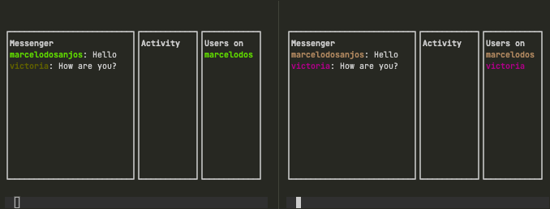

# Projeto utilizando websocket e javascript para criar um chat no terminal :rocket:

# Semana-javascript-expert03 ministrada pelo [Erick Wendel](http://github.com/ErickWendel)

## Preview



## Para executar
No seu terminal execute:
```sd
npx  @marcelosanjos/hacker-chat-client --room sala --username nome
```
